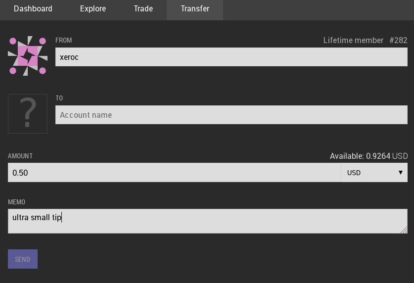
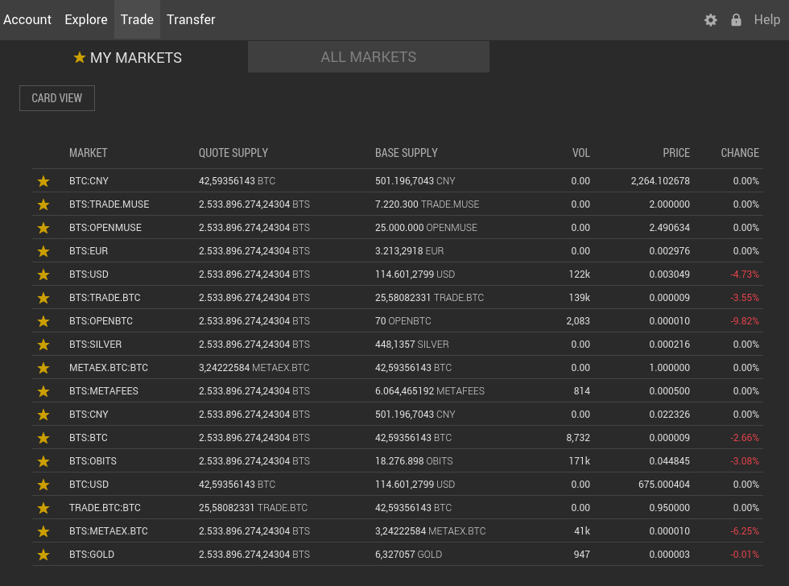
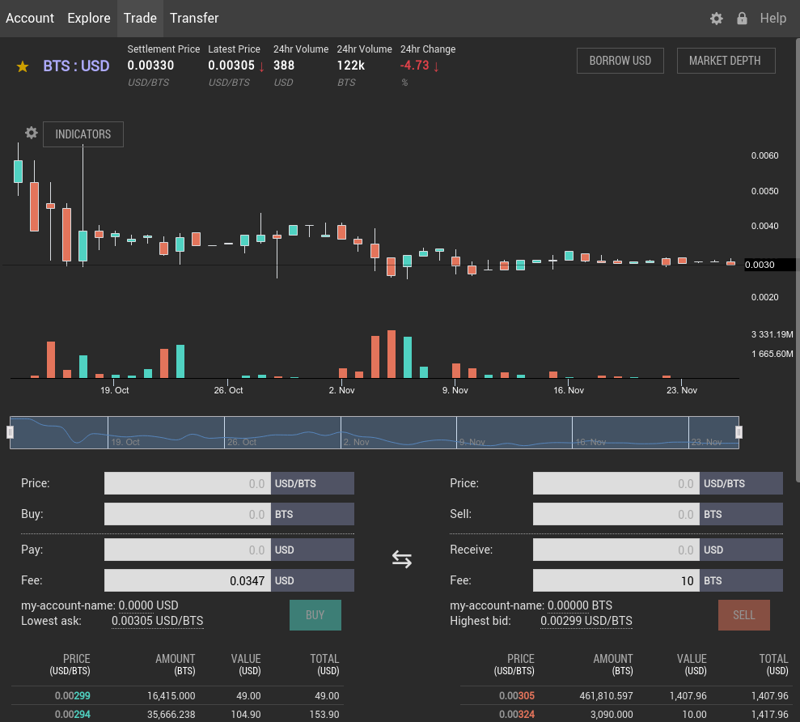

*************************
First Steps for End-Users
*************************

This guide gives a quick introduction of how to use BitShares as an end-user.

Learn about BitShares
#####################

BitShares is different from anything you have experienced yet and as such, a
user should know about risks and opportunities. 
:doc:`Read more ...  <you-should-know>`.

Choose your wallet
##################

To interact with the BitShares ecosystem, you can either

* `download the official Light Wallet`_
* or access the network in the browsers via one of our partners:

.. include:: /bitshares/register-ref.rst

Create an account
#################

In order to use BitShares, you will need to register an account.  All you need
to provide is

* an account name
* a password

The identicon at the top cn be used to verify your account name to third
parties. It is derived from your acocunt name and gives a second verification
factor. And this is how you register your account:

.. image:: create-account.png
        :alt: Create new account
        :width: 350px
        :align: center

Note that, in contrast to any other platform you have ever used:
**Creating an account at one of our partners will make your account available at
all the other partners as well.**
Hence, your account name can be seen similar to a mail address in such that it
is **unique** and every participant in the BitShares network can interact with
you independent of the actual partner providing the wallet.

Backup your account
###################

Since you are the only individual that has access to your account and funds, it
is **your responsibility** to make a secure backup of your registered account.
We recommend to backup the so called *brain key* that allows you to regain
access to your account and funds even if your wallet is destroy, deleted or
corrupted. :doc:`Read more about how to make a backup <security-brainkey>`.

Fund your account
#################

In order to fund your account you have two options:

* Fund from **outside**: Ask a partner or exchange to send funds to you. To do
                         so, you will only need to provide him your account
                         name.
* Fund from **inside**: By visiting your deposit/withdraw page in your account's
                        navigation, you can use one of our partners to move over
                        existing funds into your BitShares account.

In order to understand the meanings of different assets, we recommend you to
read through our :doc:`assets page <assets>`.

Move funds
##########

Using the *transfer* tool available from the main menu bar allows to move funds
from your account to an arbitrary other account. If you enter the transfer page,
your account name will be pre-filled into the source field. You will need to
provide the **recipient's** account name, the amount and asset to transfer and
can optionally add a memo to help the recipient to identify your transfer (the
memo is encrypted and only you and the recipient can read it).

Trade on the blockchain
#######################

To trade your assets into other assets you can use the built-in decentralized
exchange (often referred to as * the DEX*). It is available using the **Trade**
menu item and shows a list of commonly used markets.

By clicking any of the rows, you enter a particular market in which you can
participate by selling or buying from the market or by placing a orders into the
order books at **your** price.

Once an order is filled, the corresponding asset will appear in your balance
immediately. In BitShares, clearing and settlement are performed
instantaneously. 

Explore the blockchain
######################

The blockchain and business can be investigated using the built-in explorer from
the main navigation bar. There you can take a closer look at:

* the blockchain,
* the available assets,
* registered accounts,
* witnesses,
* committee members,
* markets, and
* the fee schedule.

.. image:: explorer-main.png
        :alt: Create new account
        :width: 550px
        :align: center
