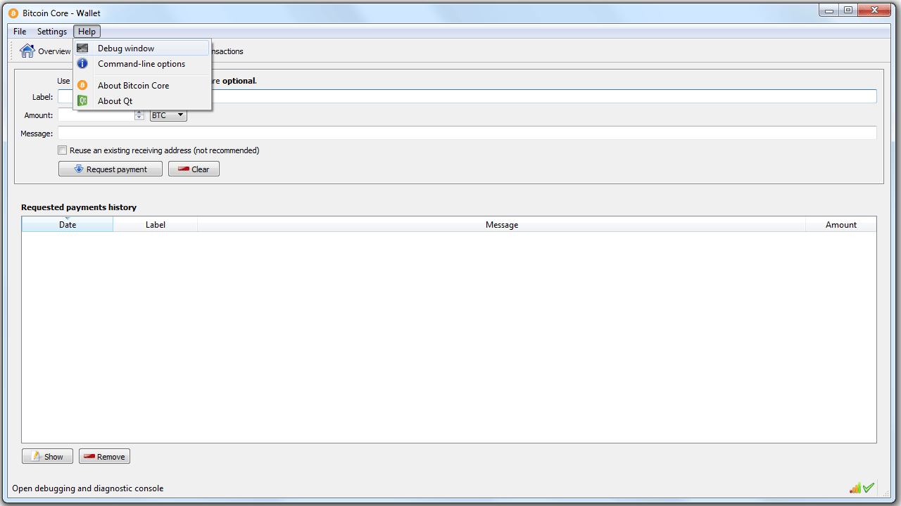

*******************************************
Exporting Private Key from Bitcoin Clients
*******************************************

The private keys required are in the so called *wallet import format* (wif),
they usually start with a ``5``.

Her is, how you export your private keys in the most common bitcoin
clients/wallets:

Bitcoin-QT
##########

For Bitcoin-qt, we first need to access the *console* via the menu bar:

After that we can unlock the wallet with the passphrase and extract the private
key with::

    walletpassphrase <passphrase> 9999
    dumpprivatekey <bitcoinaddress>

Blockchain.info
###############

The advanced settings of blockchain.info offer to export an unencrypted version
of the private key:

.. image:: blockchain.info-privkey.png
        :alt: Blockchain.info 
        :width: 800px
        :align: center

Electrum
########

In Electrum we need to go through the menu::

    Wallet -> Private Keys -> Export

There you can identify your private key.

.. image:: electrum-export.png
        :alt: Electrum
        :width: 800px
        :align: center

Armory
######

For armory users, the private key can be located by double-clicking your wallet
in the Armory main window, click "Backup this wallet", select "Export Key Lists"
and click the button of the same name. After having supplied your password,
you'll be presented with your private key in different encodings. You can remove
all checkboxes, except "Private Key (Plain Base58)". Check the "Omit spaces in
key data" box. Now select the key string and copy it to the clipboard.

.. image:: armory-export.png
        :alt: Armory
        :width: 800px
        :align: center
